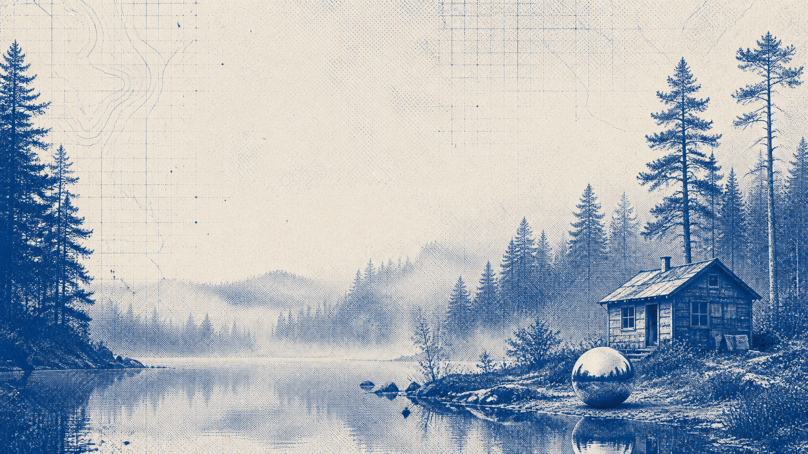

# Field Notes for Omarchy

Field Notes is an independent Omarchy theme for quiet research sessions: midnight-blue surfaces, precise pale type, and electric-blue instrument accents. It takes its visual cues from archival scientific publishing, early terminal interfaces, and monochrome field photography—not from any company artwork, logo, or typeface.

## Preview



The included wallpaper is an original three-ink night study: a deliberately sparse wireframe mountain, lake, and sphere with hard-edged halftone marks. Its navy ground is the exact base used by terminals, bars, launchers, notifications, and Chromium, so it sits behind windows as one environment rather than a separate illustration.

## Palette

| Role | Color | Use |
| --- | --- | --- |
| Midnight | `#08152E` | Main surfaces, terminal background, and wallpaper base |
| Pale ink | `#EAF0FF` | Primary text and high-contrast labels |
| Signal blue | `#3D73E8` | Focus, selection, and active controls |
| Periwinkle | `#AAB8F5` | Secondary emphasis and monitoring data |
| Rule | `#38517D` | Borders and quiet separators |
| Slate | `#8FA0BD` | Secondary labels and inactive UI |
| Verdigris | `#4F9B8C` | Success and healthy states |
| Amber | `#C28A39` | Warnings only |
| Oxide | `#C75E6A` | Errors only |

The midnight-and-ink base keeps every app on the same low-glare field; signal blue is reserved for decisions and focus. BTOP and the lock screen use the same values directly, making dense monitoring and private entry feel like purposeful instrumentation rather than a second theme.

## Included targets

The package supplies Omarchy color tokens plus Kitty, Ghostty, Alacritty, Waybar, Mako, Walker, SwayOSD, Hyprland, Hyprlock, Chromium, BTOP, VS Code, Neovim, and icon-theme settings. The file names and flat package layout follow Omarchy’s theme installer conventions.

## Installation

```bash
omarchy theme install https://github.com/notkisk/nous-theme.git
```

For a repository named `nous-theme`, Omarchy installs this package as `nous`; select that installed theme from Omarchy’s theme picker. The wallpaper is included under `backgrounds/` and can be selected through the normal Omarchy background controls.

## Design notes

- Thin periwinkle separators on navy surfaces keep the desktop structured without feeling busy.
- Compact monospace settings suit terminal, documentation, and lab-notebook work.
- Halftone landscape imagery introduces a contemplative “research in nature” note without relying on branded visual assets.
- There are no gradients, bloom effects, glass surfaces, or neon treatments.
